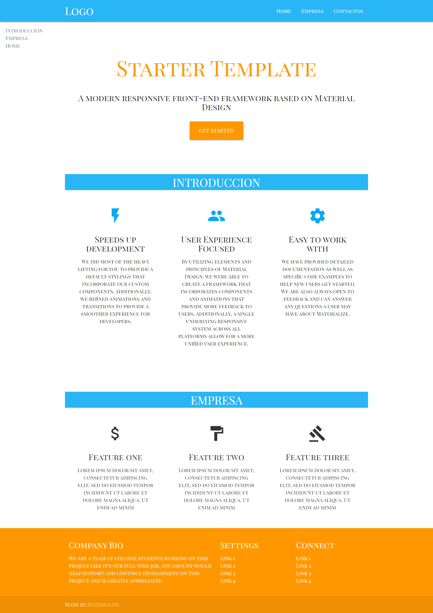

# Materialize


## material-angular ( Tenemos que instalarlo si lo necesitamos )
* https://material.angular.io/
## materialize 
### How to use Materialize CSS in Angular 7-8-9
Install the materialize-css node package in your application.
```
npm install materialize-css --save
```
Open angular.json file & add below styles & scripts.
```
  "styles": [
         "./node_modules/materialize-css/dist/css/materialize.css",
       ],
  "scripts": [
         "./node_modules/materialize-css/dist/js/materialize.js"
       ]
  ``` 
To install css and javascript script. To import the angular material theme and javascript scripts , include the given below code to your src > index.html file.
```
   <!doctype html>
<html lang="en">
<head>
 <meta charset="utf-8">
 <title>Borrar</title>
 <base href="/">
 <meta name="viewport" content="width=device-width, initial-scale=1">
 <link rel="icon" type="image/x-icon" href="favicon.ico">
 <link href="https://fonts.googleapis.com/icon?family=Material+Icons" rel="stylesheet">
</head>
<body>
 <app-root></app-root>
 <script>
 document.addEventListener('DOMContentLoaded', function() {
   var elems = document.querySelectorAll('.sidenav');
   var instances = M.Sidenav.init(elems, {});
 });
 </script>
</body>
</html>
```
## ngx-page-scroll
* https://www.npmjs.com/package/ngx-page-scroll
* https://github.com/Nolanus/ngx-page-scroll
## animate-on-scroll
* https://github.com/abhazelton/animate-on-scroll
* https://www.npmjs.com/package/ng2-animate-on-scroll
## animate.css
* https://github.com/daneden/animate.css

### Installation
Install via npm:
```
$ npm install animate.css --save
or yarn:
```
$ yarn add animate.css
```
### Usage
To use animate.css in your website, simply drop the stylesheet into your document's <head>, and add the class animated to an element, along with any of the animation names. That's it! You've got a CSS animated element. Super!


## flex-layout (esta opcion tenemos que instalarla)
* https://github.com/angular/flex-layout
 ### Getting Started
Start by installing the Angular Layout library from npm
```
 npm i -s @angular/flex-layout @angular/cdk
```
Next, you'll need to import the Layout module in your app's module.

app.module.ts
```
import { FlexLayoutModule } from '@angular/flex-layout';
...

@NgModule({
    ...
    imports: [ FlexLayoutModule ],
    ...
});
```
After that is configured, you can use the Angular Layout attributes in your HTML tags for flex layout:
```
<div fxLayout="row" fxLayoutAlign="space-between">
</div>
```
Check out all of the available options for using Angular Layout in your application.

This project was generated with [Angular CLI](https://github.com/angular/angular-cli) version 9.0.3.

## Development server

Run `ng serve` for a dev server. Navigate to `http://localhost:4200/`. The app will automatically reload if you change any of the source files.

## Code scaffolding

Run `ng generate component component-name` to generate a new component. You can also use `ng generate directive|pipe|service|class|guard|interface|enum|module`.

## Build

Run `ng build` to build the project. The build artifacts will be stored in the `dist/` directory. Use the `--prod` flag for a production build.

## Running unit tests

Run `ng test` to execute the unit tests via [Karma](https://karma-runner.github.io).

## Running end-to-end tests

Run `ng e2e` to execute the end-to-end tests via [Protractor](http://www.protractortest.org/).

## Further help

To get more help on the Angular CLI use `ng help` or go check out the [Angular CLI README](https://github.com/angular/angular-cli/blob/master/README.md).
